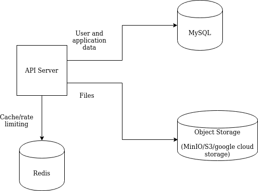

# Tarpaulin

## Architecture

Diagram:

Components:

- Our API server, built using node.js
- A redis server used for caching and rate limiting
- A MySQL database used as the primary data store for the application
- An object storage service, such as MinIO for running in local environments or AWS S3 for production environments, used to store file uploads
